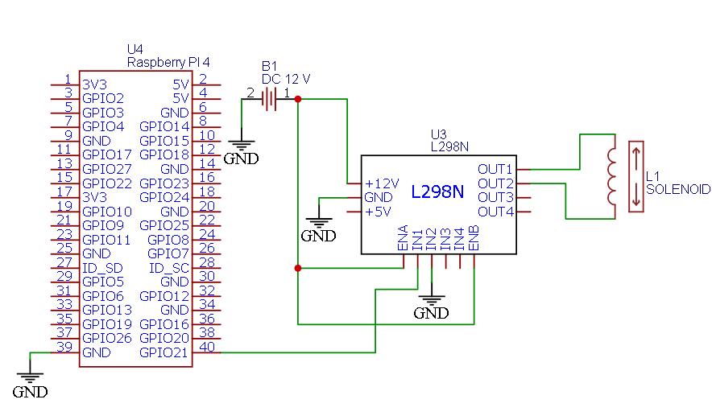
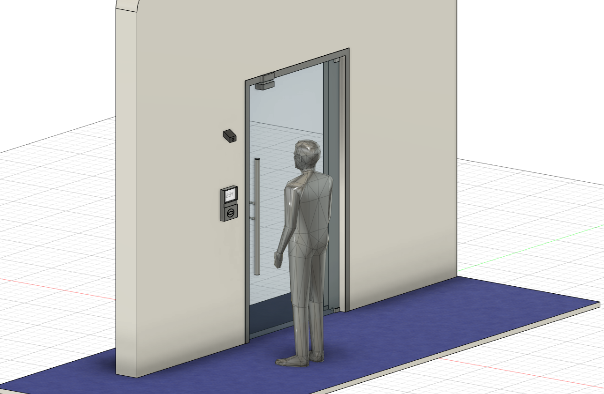
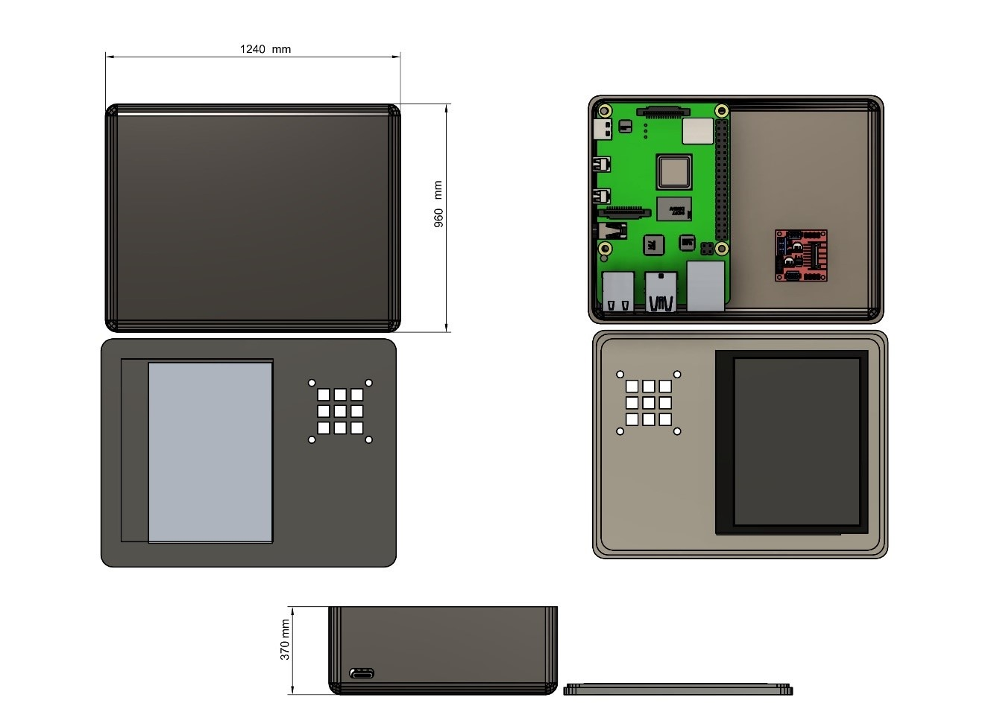
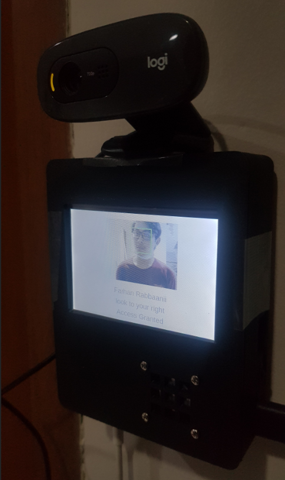

# face-recognition-with-headpose-challenge
face recognition for door access security system that works on Raspberry Pi. using HOG method and head pose estimation for second layer security. 

## Requirements
1. OpenCV
2. Dlib
3. face_recognition
4. imutils

## system spesification
1. Raspberry Pi 4 Model B 
2. Webcam Logitech C270 

## Project Schematic

## How To Use
1. first you need a face dataset of person. each person has 3 image (frontal face, 30 degrees look to the right and left). and save them to pickle file.
   <!--   -->

   
   
   

2. run `main.py` to try the code

## Device Overview
### Mock up

   
   

### Demo

   
   

### owner
- Farhan Rabbaanii - farhanrbnn@gmail.com
- Redho Bukhari Nasza - bukhari.nasza@gmail.com
